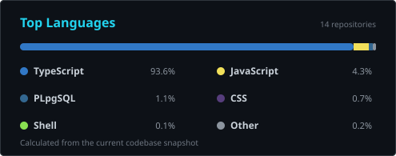

<div align="center">

  <a href="https://github.com/victor-s2">
    
  </a>

  <p>
    
    
    
  </p>

</div>

```console
victor@github:~$ whoami
> Desenvolvedor independente criando produtos web, automações e ferramentas de IA.

victor@github:~$ current_mission
> Transformar operações complexas em software claro, rápido e confiável.

victor@github:~$ stack --summary
> TypeScript / React / Node.js / Supabase / PostgreSQL / Docker
```

## `01. Sobre mim`

Eu construo produtos de ponta a ponta: da interface e experiência do usuário até banco de dados, integrações e deploy. Meus projetos passam por **SaaS vertical**, **operações de delivery**, **dashboards**, **automação**, **infraestrutura de IA** e **experiências web B2B**.

- Trabalho principalmente com **TypeScript**, **React 19** e **Node.js**.
- Uso **Supabase + PostgreSQL** para transformar protótipos em produtos com dados reais.
- Projeto interfaces operacionais com foco em clareza, velocidade e manutenção.
- Automatizo o caminho entre ideia, código, teste e produção.

## `02. Tech Stack`

<div align="center">
  
</div>

<br />

<div align="center">
  
  
  
  
  
  
</div>

## `03. Projetos em destaque`

<table>
  <tr>
    <td width="50%" valign="top">
      <h3>🦷 ZKodonto</h3>
      <p>Plataforma de gestão odontológica com agenda, operação clínica e experiência premium para equipes e pacientes.</p>
      <p><code>TanStack Start</code> <code>React 19</code> <code>Supabase</code> <code>TypeScript</code></p>
      <a href="https://kindred-connect-sigma.vercel.app"><strong>Abrir produto ↗</strong></a>
    </td>
    <td width="50%" valign="top">
      <h3>🛵 ZK Delivery</h3>
      <p>Operação de delivery em uma única interface, com mapas, relatórios e experiências web, PWA e desktop.</p>
      <p><code>React</code> <code>Supabase</code> <code>Leaflet</code> <code>Electron</code></p>
      <strong>Private build · produto em desenvolvimento</strong>
    </td>
  </tr>
  <tr>
    <td width="50%" valign="top">
      <h3>🖥️ Server Maestro</h3>
      <p>Dashboard operacional para centralizar serviços, indicadores e rotinas administrativas em uma interface objetiva.</p>
      <p><code>React</code> <code>TypeScript</code> <code>Supabase</code> <code>Vitest</code></p>
      <a href="https://zkservicos.vercel.app"><strong>Abrir dashboard ↗</strong></a>
    </td>
    <td width="50%" valign="top">
      <h3>🏭 Sherman Brasil</h3>
      <p>Experiência institucional B2B para produtos de sinalização, faixas refletivas e filmes ópticos.</p>
      <p><code>Next.js 16</code> <code>React 19</code> <code>TypeScript</code> <code>Vercel</code></p>
      <a href="https://shermanbrasil.vercel.app"><strong>Visitar site ↗</strong></a>
    </td>
  </tr>
</table>

> Os repositórios de produto são privados. As demonstrações acima mostram o resultado em produção sem expor código ou dados internos.

## `04. GitHub Analytics`

<div align="center">
  
  
</div>

<div align="center">
  
</div>

<div align="center">
  
</div>

<div align="center">
  
</div>

## `05. Contribution Matrix`

<div align="center">
  
</div>

## `06. Conecte-se`

<div align="center">
  <a href="https://github.com/victor-s2">
    
  </a>
  <a href="https://kindred-connect-sigma.vercel.app">
    
  </a>
  <a href="https://shermanbrasil.vercel.app">
    
  </a>
</div>

---

<div align="center">
  <sub><code>BUILDING USEFUL SYSTEMS // ONE ITERATION AT A TIME</code></sub>
</div>
